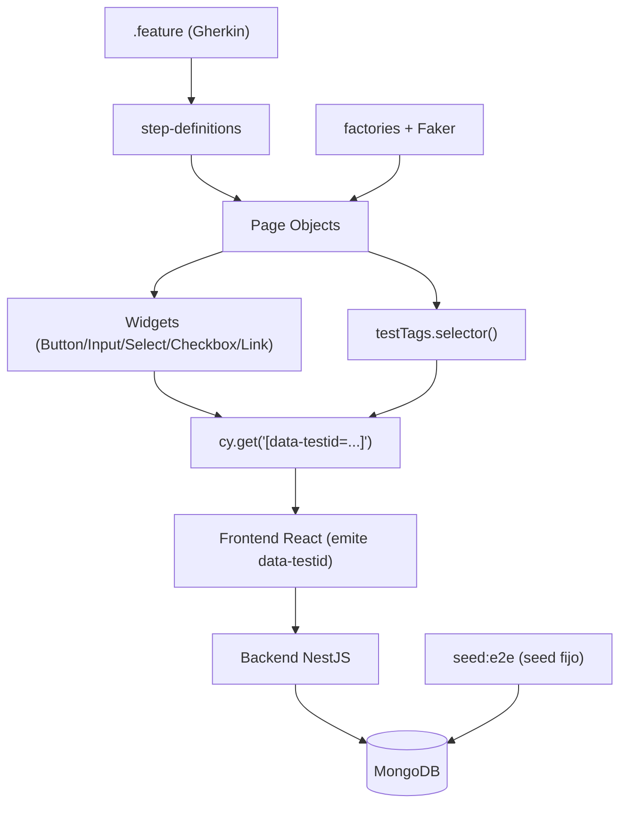
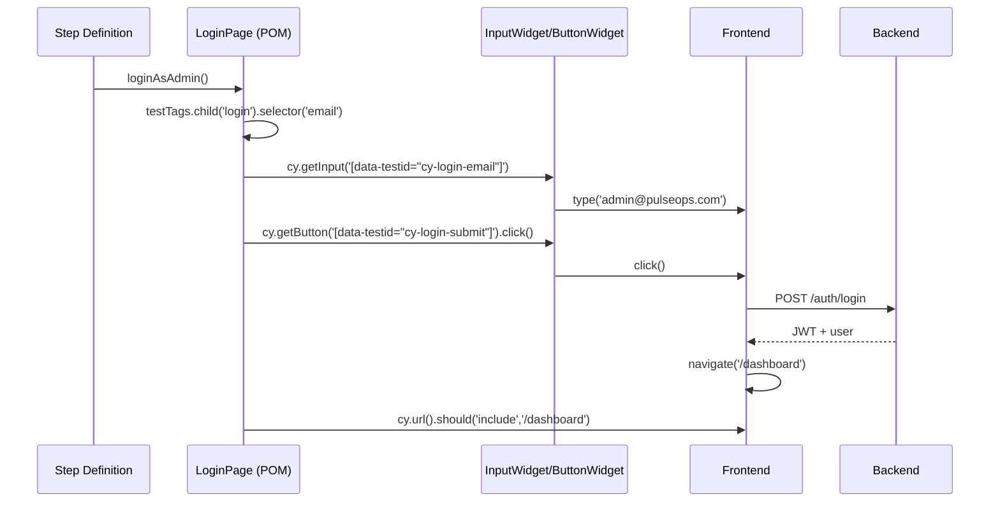
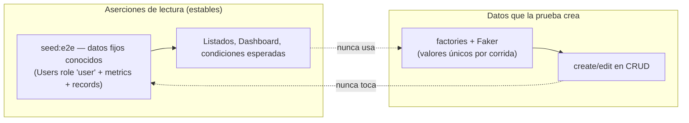

# Design Document

## Overview

Esta feature reconstruye la **suite E2E de regresión** de PulseOps sobre la infraestructura ya presente (Cypress 15 + Cucumber/Gherkin, `testTags`, Widgets y POM). El problema central no es la arquitectura de pruebas —que es razonable— sino que **falta el puente**: el frontend no emite `data-testid`, los Widgets esperan un selector y los POM actuales caen en selectores frágiles por texto/CSS. El resultado son pruebas rojas e inestables.

El diseño define cómo cerrar ese puente con la **mínima superficie de cambio**:

1. **Instrumentar el frontend** con `data-testid` deterministas usando el util `testTags` ya existente.
2. **Reconstruir los POM** para que construyan el selector `[data-testid="..."]` vía `testTags` y deleguen en los Widgets existentes (sin recrear Widgets).
3. **Datos de prueba en dos carriles**: un **seed fijo determinista** (lectura/aserciones estables) que escribe en la colección que la app realmente lee (Users con `role = 'user'` + metrics + records), y **factories con Faker** solo para lo que las pruebas crean.
4. **Login real por UI** (admin@pulseops.com), reutilizable.
5. **Estabilización incremental por módulo**, con el usuario ejecutando Cypress (el agente no puede correr `npm install` ni Cypress).

Principio rector (ponytail): reutilizar `testTags`, Widgets y la estructura de features/steps existente. No se añaden dependencias salvo `@faker-js/faker` (devDependency de test, justificada). La instrumentación con `data-testid` es aditiva: no altera estilos, clases ni accesibilidad.

### Hallazgos de la investigación (estado real del repo)

- `cypress.config.ts`: `baseUrl http://localhost:5173`, `specPattern cypress/e2e/features/**/*.feature`, reporter `cypress-mochawesome-reporter`, `retries.runMode = 2`, `defaultCommandTimeout = 10000`. El preprocesador Cucumber+esbuild ya está cableado.
- `cypress/support/commands.ts`: registra `cy.getButton/getInput/getCheckbox/getLink/getSelect`, cada uno devuelve un Widget construido con **un string** que se pasa **tal cual** a `cy.get(selector)` en `BaseWidget`. Es decir: **el string que recibe el Widget ya debe ser un selector CSS válido**, no un id pelado.
- `cypress/support/utils/testTags.ts`: `testTags.create('x') => 'cy-x'`; `testTags.selector('x') => '[data-testid="cy-x"]'`; soporta `.child(ctx)` para anidar (`cy-<ctx>-<x>`). Esta es la pieza clave para mantener consistencia frontend↔cypress.
- POM actuales (`LoginPage`, `ResourcesPage`, `ConfigurationPage`, etc.) usan `cy.contains(...)`, `input[type=email]`, `button:contains(...)`. Frágiles; se reconstruyen.
- Features (9) en `cypress/e2e/features/pulseops/` y steps en `step-definitions/pulseops/`. Se conservan las features; se reescriben steps/POM. Nota: algunas features están en inglés mezclado ("New"/"Server"); se alinean al dominio real en español.
- Frontend: login real vía `useAuth().login` (sin checkbox funcional para tests). Navegación por menú de 3 puntos en `Header.tsx` (Dashboard, Recursos, Métricas, Registros, Configuración, Usuarios solo admin) + menú de avatar (Mi Perfil, Cerrar Sesión). CRUD vía `PageHeader` (botón `action`), `SearchInput`, tablas, `ResourceModal/MetricModal/RecordModal` con sus `*Form`, `ConfirmModal`, `PaginationControls`. Toasts en `Toast.tsx` (`role="alert"`).
- Backend: `ResourcesController` **ya es proxy sobre `UsersService`** — crear un "recurso" crea un `User` con `role = 'user'` y `resourceProfile.resourceType`. La app lee de ahí. El `seed-demo-data.ts` actual escribe en el **`ResourcesService` legacy** (colección `resources`) → datos que la app de hoy **no lee**. Por eso el seed fijo de test debe ir por el camino correcto (UsersService/registro), no el legacy.

## Architecture

### Capas de la suite



### Flujo de una prueba (login UI → POM → Widget → data-testid → app)



### Decisión clave: dónde se construye el selector

Los Widgets pasan su argumento directo a `cy.get`. Hay dos formas de cablear:

- **Opción A (elegida):** el POM llama a `testTags.selector(name)` (o `child(ctx).selector(name)`) y pasa el selector CSS completo (`[data-testid="cy-..."]`) al Widget. El Widget no cambia.
- Opción B (descartada): cambiar los Widgets para que acepten un id pelado y construyan el selector. Requiere tocar `BaseWidget` y los comandos; más superficie, sin ganancia.

La Opción A respeta ponytail: **cero cambios en Widgets**, el POM es el único punto que conoce la convención `data-testid`. El frontend usa el **mismo `testTags`** (importado desde el util compartido) para emitir el id, garantizando que `create()` en la app y `selector()` en el POM coincidan.

> Nota de import: `testTags` vive hoy en `cypress/support/utils/testTags.ts`. El frontend no debe importar desde `cypress/`. Para mantener una única fuente de verdad de la convención sin acoplar build de Vite a la carpeta de Cypress, se define una **convención de strings literales** documentada en este diseño (prefijo `cy-`, contexto por página, separador `-`) y el frontend la aplica con un helper local mínimo `tid()` (ver Components). Cypress sigue usando `testTags.selector()`. Ambos producen exactamente el mismo string. Esto evita una dependencia cruzada frontend→cypress (que rompería el build del frontend) y mantiene el contrato estable y verificable.

### Convención de data-testid

Formato: `cy-<contexto>-<elemento>[-<modificador>]`, todo en kebab-case, prefijo fijo `cy`.

- `<contexto>`: la página/módulo o sub-zona (`login`, `resources`, `resource-form`, `metrics`, `records`, `dashboard`, `configuration`, `users`, `profile`, `nav`, `confirm`, `toast`).
- `<elemento>`: rol semántico del elemento (`email`, `submit`, `create`, `save`, `cancel`, `search`, `row`, `edit`, `delete`, `name`, `role-type`...).
- `<modificador>` (opcional): para listas, el **identificador estable** de la fila (ej. `cy-resources-row-<id>`), no el índice posicional.

Ejemplos:
- Input email del login: `cy-login-email`.
- Botón crear recurso: `cy-resources-create`.
- Fila de recurso con id `abc`: `cy-resources-row-abc`.
- Botón editar en esa fila: `cy-resources-row-abc-edit`.
- Contenedor de condición del dashboard: `cy-dashboard-condition`.

Las filas usan el `id` del dominio como modificador para que el selector sea estable entre corridas (Req 1.5) y permita aserciones sobre un registro concreto del seed fijo.

## Components and Interfaces

Esta sección marca claramente **[NUEVO]** y **[MODIFICAR]**.

### Frontend — helper de instrumentación

**[NUEVO]** `apps/frontend/src/utils/testId.ts`: helper mínimo para emitir ids consistentes.

```ts
// ponytail: helper de una línea por función; misma convención que cypress/support/utils/testTags.
// No importa desde cypress/ para no acoplar el build del frontend a la carpeta de tests.
const PREFIX = 'cy';
const norm = (s: string) =>
  s.trim().replace(/\s+/g, '-').replace(/[^a-zA-Z0-9-_]/g, '').toLowerCase();

/** tid('login','email') => 'cy-login-email' */
export const tid = (...segments: string[]): string =>
  [PREFIX, ...segments.map(norm)].filter(Boolean).join('-');
```

Uso en JSX (aditivo, no cambia estilos ni a11y):

```tsx
<input data-testid={tid('login','email')} type="email" ... />
<button data-testid={tid('resources','create')} ... />
{resources.map(r => (
  <tr key={r.id} data-testid={tid('resources','row', r.id)}>
    ...
    <button data-testid={tid('resources','row', r.id, 'edit')} ... />
    <button data-testid={tid('resources','row', r.id, 'delete')} ... />
  </tr>
))}
```

### Cypress — base de POM

**[NUEVO]** `cypress/support/pages/pulseops/BasePulseOpsPage.ts`: utilidades comunes (construir selector vía `testTags`, esperar toast, abrir navegación). Evita repetir el cableado en cada POM.

```ts
import { testTags } from '../../utils/testTags';

export abstract class BasePulseOpsPage {
  protected ctx: string;                 // ej. 'resources'
  constructor(ctx: string) { this.ctx = ctx; }

  /** sel('create') => '[data-testid="cy-resources-create"]' */
  protected sel(...segments: string[]): string {
    return testTags.child(this.ctx).selector(segments.join('-'));
  }
  /** selRaw('login','email') ignora ctx, para selectores globales (nav, toast) */
  protected selRaw(...segments: string[]): string {
    return testTags.selector(segments.join('-'));
  }
}
```

> `testTags.child('resources').selector('create')` produce `[data-testid="cy-resources-create"]`, idéntico a `tid('resources','create')` del frontend. Contrato cerrado.

### Cypress — POM reconstruidos

**[MODIFICAR]** Todos los POM en `cypress/support/pages/pulseops/`. Patrón ejemplo (Resources):

```ts
import { BasePulseOpsPage } from './BasePulseOpsPage';
import type { ResourceInput } from '../../factories/resourceFactory';

export class ResourcesPage extends BasePulseOpsPage {
  constructor() { super('resources'); }

  visit() { cy.visit('/resources'); return this; }

  openCreate() { cy.getButton(this.sel('create')).click(); return this; }

  fillForm(data: ResourceInput) {
    const form = (s: string) => testTags.child('resource-form').selector(s);
    cy.getInput(form('name')).type(data.name);
    cy.getSelect(form('role-type')).selectByValue(data.roleType);
    return this;
  }

  save() { cy.getButton(testTags.child('resource-form').selector('save')).click(); return this; }

  create(data: ResourceInput) { this.openCreate().fillForm(data).save(); return this; }

  search(term: string) { cy.getInput(this.sel('search')).type(term); return this; }

  editById(id: string, data: Partial<ResourceInput>) {
    cy.getButton(this.sel('row', id, 'edit')).click();
    if (data.name) cy.getInput(testTags.child('resource-form').selector('name')).type(data.name);
    this.save();
    return this;
  }

  deleteById(id: string) {
    cy.getButton(this.sel('row', id, 'delete')).click();
    cy.getButton(testTags.child('confirm').selector('accept')).click();
    return this;
  }

  shouldShowInList(name: string) { cy.get(this.sel('list')).should('contain', name); return this; }
  shouldNotShowRow(id: string)   { cy.get(this.sel('row', id)).should('not.exist'); return this; }
  shouldShowToast(text: string)  { cy.get(this.selRaw('toast')).should('be.visible').and('contain', text); return this; }
}
```

Cada POM expone métodos de alto nivel (`create/editById/deleteById/search/shouldShow*`) y oculta los selectores. Sin `cy.contains` por texto de UI ni clases CSS.

### Cypress — comando de login real

**[MODIFICAR]** `LoginPage.ts` + **[NUEVO]** comando `cy.loginAsAdmin()` en `commands.ts` que usa el POM por debajo:

```ts
// commands.ts
Cypress.Commands.add('loginAsAdmin', () => {
  cy.session('admin', () => {                 // ponytail: cy.session cachea el login real entre escenarios
    const login = new LoginPage();
    login.visit().submit('admin@pulseops.com', Cypress.env('ADMIN_PASSWORD'));
    cy.url().should('include', '/dashboard');
  });
});
```

- Login **real por UI** (Req 3.1, 3.2): escribe en el form y envía; sin inyectar tokens.
- `cy.session` cachea la sesión validada para no repetir el flujo completo en cada escenario, pero el primer login de la corrida es real y ejercita el formulario. Los escenarios de login negativo/positivo explícito (feature 01) **no** usan `cy.session`; ejecutan el flujo directo para asertar errores y redirecciones.
- La contraseña vive en `Cypress.env('ADMIN_PASSWORD')` (config local/`cypress.env.json`, no commiteado), evitando hardcodear credenciales en el repo.

### Cypress — factories

**[NUEVO]** `cypress/support/factories/`: `resourceFactory.ts`, `metricFactory.ts`, `recordFactory.ts`, `userFactory.ts`, e `index.ts`.

```ts
// resourceFactory.ts
import { faker } from '@faker-js/faker';        // prerequisito: npm i -D @faker-js/faker

export interface ResourceInput { name: string; roleType: 'DEV' | 'TL' | 'OTHER'; }

export const makeResource = (over: Partial<ResourceInput> = {}): ResourceInput => ({
  name: `${faker.person.fullName()} ${faker.string.alphanumeric(5)}`,  // sufijo único por corrida
  roleType: faker.helpers.arrayElement(['DEV', 'TL', 'OTHER']),
  ...over,
});
```

- Unicidad por corrida vía sufijo random (Req 5.2): nombres/emails con `faker.string.alphanumeric`.
- Solo para datos **que las pruebas crean** (Req 5.1, 5.5). Nunca se usan en el seed fijo.
- **Manejo de Faker no instalado (Req 5.4):** el import de `@faker-js/faker` solo se resuelve cuando una feature usa una factory. Las features de solo-lectura (que usan el seed fijo) no importan factories, por lo que la ausencia de Faker no bloquea esos módulos. El diseño documenta la instalación de Faker como **prerequisito explícito** del usuario antes de correr los módulos de creación. No se hace import perezoso artificial: se mantiene el import estándar y se aísla el uso por feature, de modo que el resto del proyecto (frontend/backend/packages) compila sin Faker porque `cypress/` no entra en sus `tsconfig`.

### Backend — seed fijo de test

**[NUEVO]** `apps/backend/src/scripts/seed-e2e-data.ts` + script `seed:e2e` en `apps/backend/package.json`.

- Escribe por el **camino correcto**: usuarios-recurso vía `AuthService.register`/`UsersService` con `role = 'user'` y `resourceProfile.resourceType`, métricas vía `MetricsService`, records vía `RecordsService`. **No** usa el `ResourcesService` legacy.
- Datos **conocidos y deterministas** (Req 4.1, 4.3): nombres, emails, claves de métrica y series de records fijas (sin random, Req 4.5). Reutiliza los patrones de condición del seed demo (PODER, AFLUENCIA, NORMAL, EMERGENCIA, PELIGRO, INEXISTENCIA) para que el Dashboard muestre condiciones predecibles (Req 11.3).
- **Idempotente**: limpia/upserta los registros de test por sus claves conocidas para producir el mismo estado en cada corrida.
- Emails de recurso fijos (ej. `e2e.poder@pulseops.test`) para poder localizar la fila por su `id` derivado de forma estable, o localizar por nombre conocido.

> Esto adelanta parte del arreglo de la deuda Resources/Users: el seed de test consume el modelo vigente (Users role 'user'), no la colección legacy. Documentado como decisión deliberada.

### Inventario de data-testid por página

Solo se instrumentan elementos que alguna prueba usa (ponytail).

| Módulo / contexto | Elementos a instrumentar (`data-testid`) | Archivos frontend [MODIFICAR] |
|---|---|---|
| Login (`login`) | `login-email`, `login-password`, `login-submit`, `login-error` | `pages/LoginPage.tsx` |
| Navegación (`nav`) | `nav-menu-toggle`, `nav-dashboard`, `nav-resources`, `nav-metrics`, `nav-records`, `nav-configuration`, `nav-users`, `nav-user-toggle`, `nav-profile`, `nav-logout` | `components/Header.tsx` |
| Resources (`resources` / `resource-form`) | `resources-create`, `resources-search`, `resources-list`, `resources-row-<id>`, `resources-row-<id>-edit`, `resources-row-<id>-delete`; form: `resource-form-name`, `resource-form-role-type`, `resource-form-active`, `resource-form-save`, `resource-form-cancel`, `resource-form-name-error` | `pages/ResourcesPage.tsx`, `components/ResourceForm.tsx`, `components/ResourceModal.tsx` |
| Metrics (`metrics` / `metric-form`) | análogo a Resources (`metrics-create`, `metrics-search`, `metrics-list`, `metrics-row-<id>`, `-edit`, `-delete`; `metric-form-*`, `-save`, `-cancel`, `-*-error`) | `pages/MetricsPage.tsx`, `components/MetricForm.tsx`, `components/MetricModal.tsx` |
| Records (`records` / `record-form`) | análogo (`records-create`, `records-list`, `records-row-<id>`, `-edit`, `-delete`; `record-form-resource`, `record-form-metric`, `record-form-week`, `record-form-value`, `-save`, `-cancel`, `-*-error`) | `pages/RecordsPage.tsx`, `components/RecordForm.tsx`, `components/RecordModal.tsx` |
| Users (`users` / `user-form`) | análogo (`users-create`, `users-search`, `users-list`, `users-row-<id>`, `-edit`, `-delete`; `user-form-name`, `user-form-email`, `user-form-role`, `-save`, `-cancel`, `-*-error`) | `pages/UsersAdminPage.tsx` (+ su modal/form) |
| Dashboard (`dashboard`) | `dashboard-resource-select`, `dashboard-metric-select`, `dashboard-condition`, `dashboard-chart` | `pages/ResourceDashboard.tsx`, `components/ResourceSelector.tsx`, `components/MetricSelector.tsx`, `components/ConditionCard.tsx` |
| Configuration (`configuration`) | `configuration-edit`, `configuration-threshold-<key>`, `configuration-save`, `configuration-error` | `pages/ConfigurationPage.tsx` |
| Profile (`profile`) | `profile-name`, `profile-email`, `profile-save`, `profile-error` | `pages/ProfilePage.tsx` |
| Confirm modal (`confirm`) | `confirm-accept`, `confirm-cancel` | `components/ConfirmModal.tsx` |
| Toasts (`toast`) | `toast` (contenedor del mensaje) | `components/Toast.tsx` |

Los `*-error` se instrumentan en el contenedor de mensaje de validación de cada form (Req 6.5/7.5/8.5/9.5/12.3/13.3). El `ResourceSelector`/`MetricSelector` usan `AutocompleteInfinite`; se instrumenta su input y la opción seleccionable necesaria para el flujo del dashboard.

### Estructura de features/steps

- **Features [MODIFICAR]**: se conservan los 9 archivos `01-authentication` … `09-profile` y su naming. Se reescribe el Gherkin para alinearlo al dominio en español y a datos del seed fijo / factories (ej. crear recurso usa un nombre de factory, no "Test Resource Cypress" fijo).
- **Steps [MODIFICAR]**: reescritos para delegar 100% en POM. `common.ts` aloja el `Background` de autenticación (`Given el usuario está autenticado` → `cy.loginAsAdmin()`).
- Naming POM ya existente se mantiene: `LoginPage`, `ResourcesPage`, `MetricsPage`, `RecordsPage`, `DashboardPage`, `ConfigurationPage`, `UsersPage`, `ProfilePage`. **[MODIFICAR]** `pages/pulseops/index.ts` para exportar todos (hoy solo exporta 3).

### Relación seed fijo vs factories



Regla dura: el seed fijo no contiene valores aleatorios (Req 4.5) y las factories no se usan para datos del seed (Req 5.5). Las aserciones de lectura van contra el seed; las de creación contra lo generado por factory.

## Data Models

### ResourceInput (factory)
```ts
interface ResourceInput { name: string; roleType: 'DEV' | 'TL' | 'OTHER'; }
```

### MetricInput (factory)
```ts
interface MetricInput { key: string; label: string; unit: string; periodType: 'weekly'; }
```

### RecordInput (factory)
```ts
interface RecordInput { resourceId: string; metricKey: string; week: string; value: number; }
```

### UserInput (factory)
```ts
interface UserInput { name: string; email: string; password: string; role: 'admin' | 'user'; }
```

### SeedDataset (seed fijo — forma conceptual)
```ts
interface SeedResource { name: string; email: string; roleType: 'DEV' | 'TL' | 'OTHER'; }
interface SeedSeries { resourceEmail: string; metricKey: string; values: number[]; expectedCondition: OperationalCondition; }
interface SeedDataset { resources: SeedResource[]; metrics: MetricInput[]; series: SeedSeries[]; }
```

`expectedCondition` enlaza cada serie conocida con la `Condicion_Operativa` que el Dashboard debe mostrar (PODER/AFLUENCIA/NORMAL/EMERGENCIA/PELIGRO/INEXISTENCIA), permitiendo la aserción del Req 11.3 contra valores deterministas.

### testId (contrato de selección)
```
data-testid = "cy-" + contexto + "-" + elemento [+ "-" + modificador]
selector    = '[data-testid="' + data-testid + '"]'
```
Invariante del contrato: `tid(...segs)` (frontend) === `testTags.child(seg0).selector(seg1..n)` (cypress) para los mismos segmentos.

## Correctness Properties

*Una propiedad es una característica o comportamiento que debe cumplirse en todas las ejecuciones válidas del sistema — esencialmente, una afirmación formal sobre lo que el sistema debe hacer. Las propiedades sirven de puente entre las especificaciones legibles por humanos y las garantías de correctitud verificables por máquina.*

Naturaleza de esta feature: es una suite de pruebas E2E. La mayoría de criterios de aceptación describen flujos de UI/integración que se validan mediante los **propios escenarios Cucumber** (ejemplos E2E), no mediante property-based testing sobre código de producción. Las propiedades universales aplican a las **piezas puras y deterministas** que sí construimos: el generador de `data-testid` (`tid`), la idempotencia del seed fijo y la unicidad de las factories.

### Property 1: Forma del testId

*Para todo* conjunto no vacío de segmentos de entrada, el `data-testid` generado por `tid(...segmentos)` comienza con el prefijo `cy-`, está en kebab-case (solo `[a-z0-9-_]`, sin espacios ni mayúsculas) y contiene cada segmento normalizado.

**Validates: Requirements 1.2**

### Property 2: Determinismo del testId

*Para todo* conjunto de segmentos de entrada, invocar `tid` repetidamente produce exactamente el mismo string, y el `testTags.selector` correspondiente en Cypress produce `[data-testid="<mismo id>"]` (el contrato frontend↔cypress coincide para las mismas entradas).

**Validates: Requirements 1.5, 1.2**

### Property 3: Idempotencia del seed fijo

*Para toda* ejecución del seed de test, ejecutarlo una vez o dos veces consecutivas produce el mismo estado observable de datos (mismos recursos, métricas y records con sus valores conocidos), sin duplicados.

**Validates: Requirements 4.3**

### Property 4: Unicidad de las factories

*Para todo* número N de invocaciones de una factory dentro de una corrida, los valores de los campos declarados únicos (nombre, email) no presentan colisiones entre las N instancias generadas.

**Validates: Requirements 5.2**

## Error Handling

- **Selector ausente (Req 1.4):** si un elemento cubierto no expone su `data-testid`, `cy.get` falla por timeout (`defaultCommandTimeout = 10000`) con un mensaje que incluye el selector buscado (`[data-testid="cy-..."]`), identificando el id ausente. No se añaden reintentos infinitos; `retries.runMode = 2` ya está configurado para flake.
- **Validación de formularios (Req 6.5/7.5/8.5/9.5/12.3/13.3):** los POM verifican el contenedor `*-error` y que el listado/estado no cambió. La app ya muestra errores de validación (react-hook-form + zod/yup) y toasts de error; el POM asierta sobre el `data-testid` del mensaje, no sobre el texto exacto, para robustez.
- **Login inválido (Req 3.4):** el POM verifica `cy-login-error` visible y `cy.url()` aún en `/login`.
- **Faker no instalado (Req 5.4):** los módulos de solo-lectura no importan factories, por lo que corren sin Faker. Los módulos de creación documentan la instalación como prerequisito; si falta, el spec de ese módulo falla al resolver el import — fallo claro y accionable, no un error silencioso.
- **Seed fallido:** el script `seed:e2e` aborta con código de salida ≠ 0 y log del error (mismo patrón que `seed-demo-data.ts`), de modo que el usuario detecta el problema antes de correr Cypress.
- **Aislamiento de sesión:** `cy.session('admin', ...)` cachea por clave; si la validación de sesión falla, Cypress re-ejecuta el setup de login real.

## Testing Strategy

### Enfoque dual

- **Escenarios E2E (Cucumber/Gherkin):** son el corazón de esta feature. Cubren todos los criterios marcados como *ejemplo* en el prework (autenticación, navegación, CRUD de Resources/Metrics/Records/Users, dashboard, configuración, perfil). Validan flujos de UI extremo a extremo contra la app real. Estos NO son property-based; son ejemplos representativos por escenario, ejecutados por el usuario (el agente no corre Cypress).
- **Pruebas unitarias property-based:** aplican solo a las piezas puras y deterministas (Propiedades 1-4). Son ligeras y NO requieren Cypress ni la app corriendo; corren con el typecheck/test del workspace correspondiente.

### Pruebas property-based

- **Librería:** `fast-check` (ecosistema TS/JS, estándar para PBT en este stack). Es la elección idiomática; no se implementa PBT desde cero. **Prerequisito de instalación por el usuario** (devDependency), igual que Faker. Mientras no esté instalada, estas pruebas no bloquean el resto del proyecto (viven aisladas en su archivo de test).
- **Configuración:** mínimo 100 iteraciones por propiedad (`fc.assert(..., { numRuns: 100 })`).
- **Ubicación:** las propiedades de `tid` y factories se prueban junto al helper (ej. `apps/frontend/src/utils/testId.test.ts` para `tid`; `cypress/support/factories/*.spec.ts` para unicidad). La idempotencia del seed se valida con una prueba de integración del script contra una base de test (o, de no haber runner de integración disponible, como verificación ejecutable manual documentada).
- **Etiquetado:** cada prueba property-based lleva un comentario referenciando la propiedad del diseño.
  - Formato: `// Feature: e2e-regression-suite, Property {número}: {texto}`.
- Cada propiedad de correctitud se implementa con **una sola** prueba property-based.

Mapa propiedad → prueba:
- Property 1 (Forma del testId) → test sobre `tid` con segmentos arbitrarios.
- Property 2 (Determinismo del testId) → test que compara dos invocaciones y el contrato con `testTags.selector`.
- Property 3 (Idempotencia del seed) → test de integración: ejecutar seed dos veces y comparar estado.
- Property 4 (Unicidad de factory) → test que genera N instancias y verifica unicidad de nombre/email.

### Pruebas unitarias (ejemplos y edge cases)

- Edge case Req 1.4: una prueba que apunta a un `data-testid` inexistente y verifica que falla con mensaje que contiene el selector (puede ser una verificación ligera del comportamiento del Widget).
- Verificación ejecutable mínima (ponytail / regla tech.md): para `tid`, un `testId.test.ts` con asserts cubre las Propiedades 1 y 2 y sirve de check ejecutable sin frameworks pesados.

### Validación incremental (Req 14)

Orden de estabilización: **Auth → Resources → Metrics → Records → Dashboard → Configuration → Users → Profile**. Por módulo:

1. Instrumentar el frontend con `data-testid` (solo elementos usados).
2. Reconstruir el POM sobre Widgets + `testTags`.
3. Reescribir steps y, si aplica, ajustar el Gherkin.
4. `getDiagnostics` sobre los archivos tocados + `typecheck` del workspace.
5. **El usuario** corre Cypress de ese módulo y reporta; se itera hasta verde antes de avanzar.

Prerequisitos que ejecuta el usuario (el agente no puede): `npm install -D @faker-js/faker fast-check`, `npm run seed:e2e` (backend), levantar frontend (5173) + backend (3000) + MongoDB, y correr Cypress. El agente nunca lanza servidores, watchers ni Cypress por bash.

---

¿Revisamos el diseño? Si estás de acuerdo, en la fase de tasks lo desglosamos en el orden incremental (Auth primero). Si quieres ajustar la convención de `data-testid`, el alcance del inventario, la elección de `fast-check`/Faker, o el camino del seed fijo, dímelo y lo incorporo antes de pasar a tareas. También puedo volver a requirements si detectas algún hueco.
