# 🔄 CI/CD Pipeline - PulseOps

Documentación del pipeline de integración continua y despliegue continuo con GitHub Actions y Cypress.

## 📋 Tabla de Contenidos

- [Descripción General](#descripción-general)
- [Pipeline Jobs](#pipeline-jobs)
- [Configuración](#configuración)
- [Tests E2E con Cypress](#tests-e2e-con-cypress)
- [Docker Registry](#docker-registry)
- [Despliegue Automático](#despliegue-automático)

## 🎯 Descripción General

El pipeline CI/CD automatiza:

✅ **Lint y validación de código**  
✅ **Tests unitarios e integración**  
✅ **Tests E2E con Cypress**  
✅ **Build de imágenes Docker**  
✅ **Escaneo de seguridad**  
✅ **Publicación a Docker Hub**  

## 🔧 Pipeline Jobs

### 1️⃣ Lint & Type Check
- Ejecuta ESLint en todo el código
- Verifica tipos con TypeScript
- Compila todos los workspaces

**Triggers**: Push/PR a `dev` o `main`

```yaml
runs-on: ubuntu-latest
node-version: '20'
```

### 2️⃣ Unit & Integration Tests
- Inicia MongoDB en servicio
- Ejecuta tests del backend
- Ejecuta tests del frontend

**Dependencias**: Lint exitoso

```yaml
services:
  mongodb: mongo:7.0
env:
  MONGODB_URI: mongodb://localhost:27017/pulseops_test
```

### 3️⃣ E2E Tests (Cypress)
- Inicia MongoDB, Backend y Frontend
- Ejecuta suite completa de Cypress
- Genera screenshots y videos
- Sube artefactos en caso de fallo

**Dependencias**: Tests unitarios exitosos

**Artefactos generados**:
- `cypress-screenshots` (solo en fallos)
- `cypress-videos` (siempre)
- `cypress-reports` (siempre)

### 4️⃣ Build Docker Images
- Construye imágenes multi-stage
- Publica a Docker Hub
- Usa cache de registry para optimizar

**Dependencias**: Todos los tests exitosos  
**Triggers**: Push a `dev` o `main` únicamente

**Imágenes publicadas**:
- `{username}/pulseops-backend:latest`
- `{username}/pulseops-backend:dev-{sha}`
- `{username}/pulseops-frontend:latest`
- `{username}/pulseops-frontend:dev-{sha}`

### 5️⃣ Security Scan
- Escanea código con Trivy
- Detecta vulnerabilidades
- Reporta a GitHub Security

**Dependencias**: Build exitoso  
**Triggers**: Push a `main` únicamente

## ⚙️ Configuración

### Secrets de GitHub

Configura estos secrets en tu repositorio:
`Settings` → `Secrets and variables` → `Actions` → `New repository secret`

| Secret | Descripción | Ejemplo |
|--------|-------------|---------|
| `DOCKERHUB_USERNAME` | Usuario de Docker Hub | `jairzea` |
| `DOCKERHUB_TOKEN` | Token de acceso de Docker Hub | `dckr_pat_xxx...` |

#### Crear Token de Docker Hub:
1. Ir a https://hub.docker.com/settings/security
2. Click en "New Access Token"
3. Nombre: `github-actions-pulseops`
4. Permisos: Read, Write, Delete
5. Copiar token generado

### Variables de Entorno del Pipeline

Configuradas en `.github/workflows/ci-cd.yml`:

```yaml
env:
  NODE_VERSION: '20'
  MONGODB_VERSION: '7.0'
```

### Configuración de Cypress

**cypress.config.ts**:
```typescript
export default defineConfig({
  e2e: {
    baseUrl: 'http://localhost:5173',
    video: true,
    screenshotOnRunFailure: true,
    videosFolder: 'cypress/videos',
    screenshotsFolder: 'cypress/screenshots',
    reporter: 'cypress-multi-reporters',
    reporterOptions: {
      configFile: 'reporter-config.json',
    },
  },
})
```

**package.json**:
```json
{
  "scripts": {
    "cypress:open": "cypress open",
    "cypress:run": "cypress run --spec 'cypress/e2e/features/pulseops/**/*.feature'"
  }
}
```

## 🧪 Tests E2E con Cypress

### Estructura de Tests

```
cypress/
├── e2e/
│   └── features/
│       └── pulseops/
│           ├── 01-login.feature
│           ├── 02-dashboard.feature
│           ├── 03-resources.feature
│           └── ...
├── step-definitions/
│   ├── login.steps.ts
│   ├── dashboard.steps.ts
│   └── ...
├── support/
│   ├── commands.ts
│   ├── pages/
│   └── utils/
└── fixtures/
    └── testData.json
```

### Ejecutar Tests Localmente

```bash
# Asegurar que backend y frontend estén corriendo
npm run dev --workspace=apps/backend
npm run dev --workspace=apps/frontend

# Abrir Cypress interactivo
npm run cypress:open

# Ejecutar tests en modo headless
npm run cypress:run
```

### Debug de Tests Fallidos

Cuando un test falla en CI:

1. **Ir a la pestaña Actions** del repositorio
2. **Seleccionar el workflow fallido**
3. **Descargar artefactos**: Screenshots, Videos, Reports
4. **Revisar logs** del step "Run Cypress E2E Tests"

### Mejores Prácticas

✅ **Usar custom commands** en `support/commands.ts`  
✅ **Page Object Model** en `support/pages/`  
✅ **Datos de prueba** en `fixtures/`  
✅ **Wait estratégico** con `cy.wait('@apiCall')`  
✅ **Selectores data-cy** en lugar de clases CSS  

```typescript
// Ejemplo: support/commands.ts
Cypress.Commands.add('login', (username, password) => {
  cy.visit('/login')
  cy.get('[data-cy=username]').type(username)
  cy.get('[data-cy=password]').type(password)
  cy.get('[data-cy=submit]').click()
  cy.url().should('include', '/dashboard')
})
```

## 🐳 Docker Registry

### Tagging Strategy

- **`latest`**: Última versión de la rama `main`
- **`dev`**: Última versión de la rama `dev`
- **`{branch}-{sha}`**: Específico por commit (ej: `dev-abc123`)

### Pull de Imágenes

```bash
# Latest (producción)
docker pull jairzea/pulseops-backend:latest
docker pull jairzea/pulseops-frontend:latest

# Dev (desarrollo)
docker pull jairzea/pulseops-backend:dev
docker pull jairzea/pulseops-frontend:dev

# Commit específico
docker pull jairzea/pulseops-backend:dev-abc123
```

### Registry Cache

El pipeline usa cache de registry para acelerar builds:

```yaml
cache-from: type=registry,ref=${{ secrets.DOCKERHUB_USERNAME }}/pulseops-backend:buildcache
cache-to: type=registry,ref=${{ secrets.DOCKERHUB_USERNAME }}/pulseops-backend:buildcache,mode=max
```

Esto reduce el tiempo de build en ~50-70%.

## 🚀 Despliegue Automático

### Flujo de Trabajo

```mermaid
graph LR
    A[Código] --> B[Push a dev]
    B --> C[CI Pipeline]
    C --> D[Tests Pass]
    D --> E[Build Docker]
    E --> F[Push to Registry]
    F --> G[Desplegar a Staging]
    
    H[PR a main] --> I[Review]
    I --> J[Merge]
    J --> K[CI Pipeline]
    K --> L[Tests + Security]
    L --> M[Build Docker]
    M --> N[Push to Registry]
    N --> O[Desplegar a Producción]
```



### Deployment con GitHub Actions (Opcional)

Agregar job de deployment al workflow:

```yaml
deploy-staging:
  name: Deploy to Staging
  runs-on: ubuntu-latest
  needs: build-docker
  if: github.ref == 'refs/heads/dev'
  
  steps:
    - name: Deploy to staging server
      uses: appleboy/ssh-action@v0.1.10
      with:
        host: ${{ secrets.STAGING_HOST }}
        username: ${{ secrets.STAGING_USER }}
        key: ${{ secrets.STAGING_SSH_KEY }}
        script: |
          cd /opt/pulseops
          docker compose pull
          docker compose up -d
          docker compose ps
```

### Webhook para Auto-Deploy

Configurar webhook en servidor:

```bash
# Crear script webhook.sh
#!/bin/bash
cd /opt/pulseops
git pull origin main
docker compose -f config/docker-compose.prod.yml pull
docker compose -f config/docker-compose.prod.yml up -d
```

```bash
# Configurar webhook service
sudo nano /etc/systemd/system/pulseops-webhook.service
```

## 📊 Monitoring del Pipeline

### GitHub Actions Dashboard

- Ver todos los workflows: `Actions` tab
- Filtrar por branch: `Branch: dev`
- Ver tiempo de ejecución: Gráficos de tendencias

### Métricas Importantes

- ⏱️ **Tiempo total**: ~10-15 minutos
- 🧪 **Tests E2E**: ~5 minutos
- 🐳 **Build Docker**: ~3 minutos
- ✅ **Success rate**: >95% objetivo

### Optimizaciones

1. **Cache de dependencias npm**: Ahorra ~2 min
2. **Registry cache Docker**: Ahorra ~3 min
3. **Parallel jobs**: Lint + Tests en paralelo

## 🔍 Troubleshooting

### Tests E2E Fallan Intermitentemente

**Problema**: Race conditions, timeouts

**Solución**:
```typescript
// Usar wait adecuado
cy.intercept('GET', '/api/resources').as('getResources')
cy.visit('/dashboard')
cy.wait('@getResources')
cy.get('[data-cy=resource-list]').should('be.visible')
```

### Build Docker Timeout

**Problema**: Build tarda >60 min

**Solución**:
- Verificar `.dockerignore` excluye node_modules
- Usar multi-stage build
- Activar registry cache

### Security Scan Bloquea Deploy

**Problema**: Vulnerabilidades detectadas

**Solución**:
1. Revisar reporte en Security tab
2. Actualizar dependencias: `npm audit fix`
3. Si es falso positivo, agregar excepción

## 📚 Recursos

- [GitHub Actions Docs](https://docs.github.com/en/actions)
- [Cypress Best Practices](https://docs.cypress.io/guides/references/best-practices)
- [Docker Hub](https://hub.docker.com)
- [Trivy Security Scanner](https://github.com/aquasecurity/trivy)

## 🆘 Soporte

Si el pipeline falla:
1. Revisar logs detallados del job fallido
2. Reproducir localmente el paso que falla
3. Verificar secrets y variables de entorno
4. Consultar esta documentación
5. Abrir issue en GitHub con los detalles
